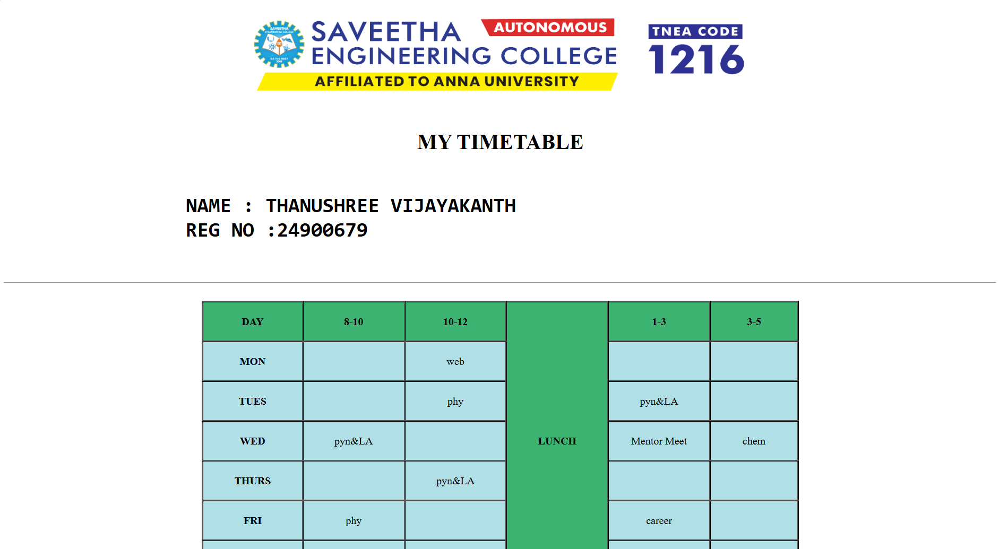
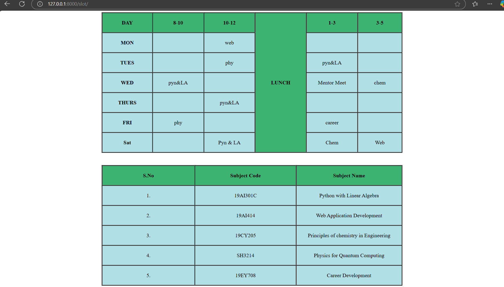

# Ex03 Time Table
# Date: 21.10.2024
# AIM
To write a html webpage page to display your slot timetable.

# ALGORITHM
## STEP 1
Create a Django-admin Interface.

## STEP 2
Create a static folder and inert HTML code.

## STEP 3
Create a simple table using `<table>` tag in html.

## STEP 4
Add header row using  `<th>` tag.

## STEP 5
Add your timetable using `<td>` tag.

## STEP 6
Execute the program using runserver command.

# PROGRAM
```
<doctype HTML!>
    <html>

        <head>
            <title>slot</title>
        </head>
        
        <body>
            <center>
                
                </center>
            <br>
            <h1 style="text-align: center;">MY TIMETABLE</h1></head>
            <pre><h1><BIG>
                NAME : THANUSHREE VIJAYAKANTH
                REG NO :24900679</BIG></h1>
            </pre>
            <hr>
            <br>
            
            <style>
                table,th,td{
                    text-align: center;
                    border:3px inset black;
                    border-collapse: collapse;
                    height:60px;
                    width:900px;
                    vertical-align: center;
                    scroll-behavior: smooth;
                
                }
            </style>
            <center>
            <table>
                <tr bgcolor="mediumseagreen">
                    <th>DAY</th>
                    <th>8-10</th>
                    <th>10-12</th>
                    <th rowspan="7">LUNCH</th>
                    <th>1-3</th>
                    <th>3-5</th>
                
                </tr>
                <tr bgcolor="powderblue">
                    <th>MON</th>
                    <td></td>
                    <td>web</td>
                    <td></td>
                    <td></td>

                </tr>
                <tr bgcolor="powderblue">
                    <th>TUES</th>
                    <td></td>
                    <td>phy</td>
                    <td>pyn&LA</td>
                    <td></td>

                </tr>
                <tr bgcolor="powderblue">
                    <th>WED</th>
                    <td>pyn&LA</td>
                    <td></td>
                    <td>Mentor Meet</td>
                    <td>chem</td>

                </tr>
                <tr bgcolor="powderblue">
                    <th>THURS</th>
                    <td></td>
                    <td>pyn&LA</td>
                    <td></td>
                    <td></td>

                </tr>
                <tr bgcolor="powderblue">
                    <th>FRI</th>
                    <td>phy</td>
                    <td></td>
                    <td>career</td>
                    <td></td>
                
                </tr>
                <tr bgcolor="powderblue">
                    <th>Sat</th>
                    <td></td>
                    <td>Pyn & LA</td>
                    <td>Chem</td>
                    <td>Web</td>

                </tr>
            </table>
            <br>
            <br>

            <table>
                <tr bgcolor="mediumseagreen">
                    <th>S.No</th>
                    <th>Subject Code</th>
                    <th>Subject Name</th>
                </tr>
                <tr bgcolor="powderblue">
                    <td>1.</td>
                    <td>19AI301C</td>
                    <td>Python with Linear Algebra</td>
                </tr>
                <tr bgcolor="powderblue">
                    <td>2.</td>
                    <td>19AI414</td>
                    <td>Web Application Development</td>
                </tr>
                <tr bgcolor="powderblue">
                    <td>3.</td>
                    <td>19CY205</td>
                    <td>Principles of chemistry in Engineering</td>
                </tr>
                <tr bgcolor="powderblue">
                    <td>4.</td>
                    <td>SH3214</td>
                    <td>Physics for Quantum Computing</td>
                </tr>
                <tr bgcolor="powderblue">
                    <td>5.</td>
                    <td>19EY708</td>
                    <td>Career Development</td>
                </tr>

            </table>
            </center>
        </body>
    </html>
```
# OUTPUT





# RESULT
The program for creating slot timetable using basic HTML tags is executed successfully.
